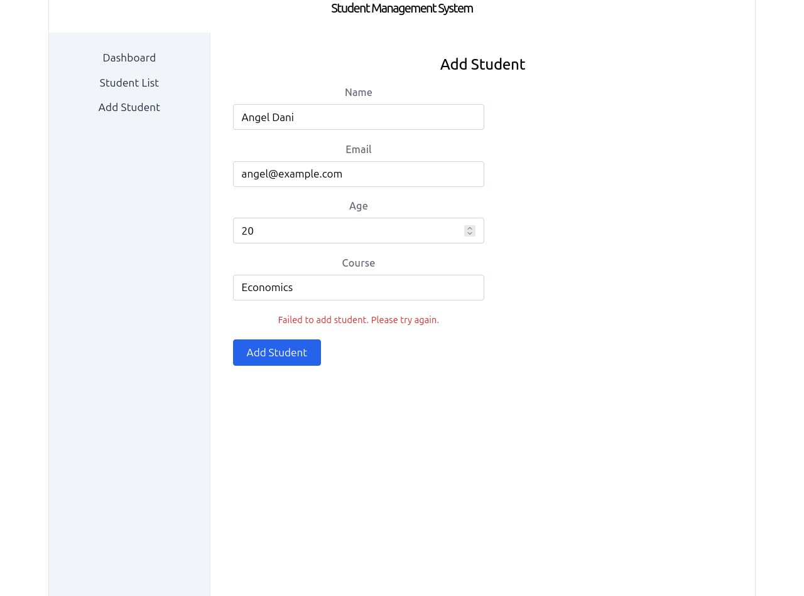
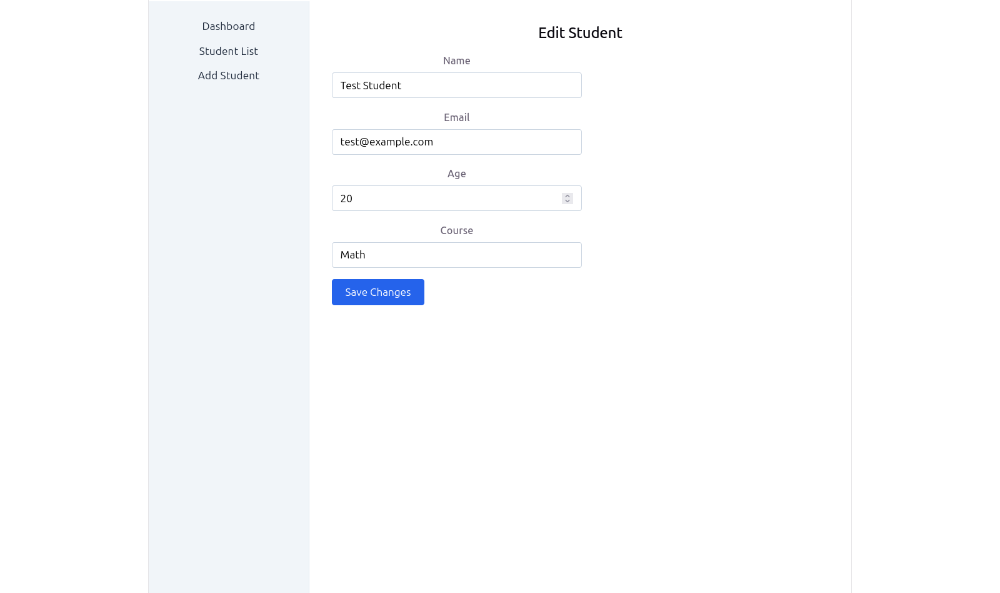
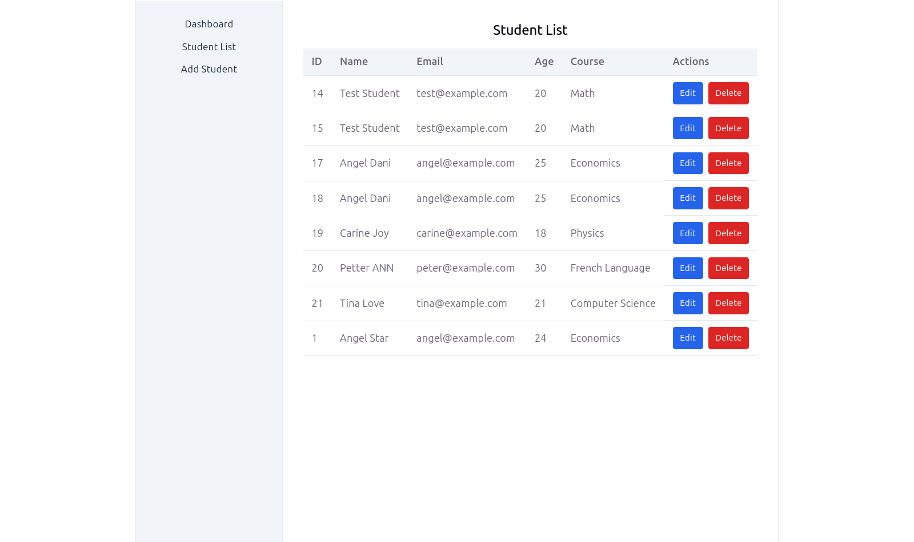

## React FastAPI Lab

## Demo Video
[Watch the demo recording](demo/demo-recording.webm)


A React frontend built to connect with
the FastAPI Student Management API
(`student-api`), completed as part of a
multi-day full-stack challenge (Days- 14).

## Tech Stack

- **React** (via Vite) - frontend framework
- **React Router** - client-side routing
- Plain CSS (component-scoped stylesheets)

## Setup

```bash
git clone <your-repo-url>
cd react- fastapi-lab
npm install
npm run dev

Visit http://localhost:5173 to view the app.

Project Structure

src/
├── components/       # Reusable UI pieces (Navbar, Sidebar)
├── layouts/          # Page layout wrappers (DashboardLayout)
├── pages/            # Route-level pages (StudentList, AddStudent)
├── App.jsx           # Routing setup
└── main.jsx          # App entry point

Scaffolded the React app and built a responsive dashboard layout.


## Screenshots

**Student List**


**Add Student**


**Edit Student**


**Mobile View**


What I built

New Vite + React app (react-fastapi-lab)
Navbar component — app title, nav links, and a mobile menu button
Sidebar component — navigation links, collapsible on smaller screens
DashboardLayout — combines Navbar + Sidebar + page content, manages sidebar open/close state
Placeholder pages: StudentList, AddStudent
Responsive behavior: sidebar hides behind a ☰ button on screens under 768px wide

Challenges

Hit several Failed to resolve import errors from Vite because some component/page files (e.g. DashboardLayout.css, StudentList.jsx) hadn’t been created yet when App.jsx already referenced them.
A filename mismatch (StudentsList.jsx vs. the expected StudentList.jsx) caused an import error — file names must match imports exactly, including plural/singular forms.
Learned to test responsive layouts using browser DevTools’ device toolbar instead of physically resizing the window.

What I learned

React component files and their CSS are typically paired 1:1 and imported directly into the component (import "./Navbar.css").
Vite’s error overlay clearly names the missing file and import path, which makes tracking down typos/missing files straightforward once you know to check both file existence and exact naming.
Separating layout (DashboardLayout) from reusable pieces (Navbar, Sidebar) from routed pages (StudentList, AddStudent) keeps the folder structure scalable as more pages get added in later days.


To add it:
```bash
code README.md


## Day 11 — Student Management UI (React Hooks)

Built the student table and add-student form using `useState` for controlled inputs and client-side validation.

### What I built
- `StudentList` page — renders a table of hardcoded mock students (id, name, email, age, course)
- `AddStudent` page — controlled form with fields for name, email, age, course
- Form state managed via `useState`, with a matching `errors` state for validation messages
- Validation: all fields required, email must match a basic email pattern, age must be a positive number
- On successful submit, form data is logged to the console and the form resets

### Challenges
- None major — this built cleanly on top of Day 10's layout and routing.

### What I learned
- Controlled inputs mean React state is the single source of truth for form values — every keystroke updates state via `onChange`, and the input's `value` always reflects that state back.
- Validation can run entirely client-side before submission, giving instant feedback without needing the backend — though server-side validation (which the FastAPI backend already has) is still necessary as a second line of defense.
- Using a single `formData` object with one `handleChange` function (keyed by `e.target.name`) avoids writing a separate `useState` and handler for every individual field


## Day 12 — Connect React to FastAPI

Replaced hardcoded student data with real API calls using Axios, and enabled CORS on the backend so the two apps can communicate.

### What I built
- Enabled CORS in FastAPI (`CORSMiddleware`), allowing requests specifically from `http://localhost:5173`
- Created `src/api.js` — a reusable Axios instance pointing to the FastAPI base URL (`http://127.0.0.1:8000`)
- `StudentList` now fetches real data from `GET /students` on mount via `useEffect`, with loading and error states
- `AddStudent` now POSTs to `/students` instead of just logging to console, keeping the same client-side validation from Day 11
- Verified in the browser's Network tab that requests actually reach the backend and return real data

### Known issue
- `POST /students` requires a valid JWT (added in Day 9's backend auth work), but the React app doesn't have login/authentication built yet. Submitting the Add Student form currently returns a `401 Unauthorized`. This is expected given the current state of the frontend, not a bug — it will be addressed once user login is added to the React app in a later day.

### Challenges
- `axios` and the `src/api.js` file hadn't actually been created despite following the setup steps — a paste didn't take effect. Caught this by running `grep` and `cat -n` to directly inspect file contents rather than assuming a paste succeeded.
- Discovered a duplicate `src/layout` folder (missing the "s") sitting alongside the correct `src/layouts` — leftover from earlier setup. Removed it after confirming the app was importing from the correctly named folder.

### What I learned
- CORS is a browser-side protection — the backend must explicitly allow the frontend's origin, or requests get blocked before reaching any route logic, regardless of whether the code itself is correct.
- The Network tab in DevTools is the most reliable way to verify what's actually happening between frontend and backend — more precise than just watching page behavior.
- Always verify a file's actual contents after a paste/edit (`cat -n`) rather than assuming it worked — copy/paste and terminal quirks can silently fail.


## Day 13 — Update & Delete Students (Loading, Errors, Toasts)

Completed the CRUD flow with Edit and Delete functionality, proper loading states, and toast notifications.

### What I built
- Edit and Delete buttons on every row in the student table
- `EditStudent` page — fetches the existing student via `GET /students/{id}`, pre-fills a form, and submits changes via `PUT /students/{id}`
- Delete button calls `DELETE /students/{id}` after a native browser confirmation prompt
- Loading states on both buttons ("Saving...", "Deleting...") disable the button and show progress during the request
- Errors are surfaced to the user via toast notifications and inline messages, never silently swallowed
- Bonus: integrated `react-hot-toast` for success/error notifications across Add, Edit, and Delete actions

### Challenges
- Repeatedly ran `uvicorn` and `npm run dev` in the wrong project folder (mixing up `student-api` and `react-fastapi-lab`), which caused confusing "module not found" and connection errors that looked like application bugs but were just terminal location mistakes.
- A stale/cached page load initially showed "Failed to load students" even though the backend was working — resolved with a hard refresh (`Ctrl+Shift+R`).
- Confirmed the `POST /students` 401 (documented in Day 12) is still present and expected, since frontend login hasn't been built yet — verified this doesn't affect Edit/Delete, which don't require auth.

### What I learned
- Running a full-stack app requires two servers active simultaneously, each in its own terminal tab, in its own correct folder — easy to lose track of which terminal is which.
- A "connection refused" or blank page error doesn't always mean the code is broken — checking whether the dev server is actually still running is often the first thing to verify.
- Toast notifications (via `react-hot-toast`) give much clearer, less intrusive feedback than `alert()` or silent failures, and make loading/error states visible without extra UI work.


## Day 14 — Final Polish: Login & Full CRUD

Added authentication to the frontend, completing the full CRUD flow end-to-end.

### What I built
- `Login` page — submits credentials to `POST /auth/login`, stores the returned JWT in `localStorage`
- Updated `api.js` with an Axios request interceptor that automatically attaches the saved token as a `Bearer` header on every request
- Verified full CRUD now works end-to-end while authenticated: Create, Read, Update, Delete all succeed
- Added a Login link to the Navbar
- Confirmed responsive design still holds up across all pages
- Added README screenshots for both repositories

### Challenges
- A typo (`localstorage` instead of `localStorage`) silently crashed the login submit handler with a `ReferenceError`, which surfaced first as a confusing CORS error in the browser console before the real cause was found.
- A malformed JSX route definition (`<Routes path=... />` instead of `<Route path=... />`) broke routing until corrected.
- Screenshot files ended up misplaced in the wrong project folder during setup; resolved using `find` to locate them and `mv` to relocate them correctly.

### What I learned
- A JavaScript `ReferenceError` inside a `.then()`/`.catch()` chain can surface as a misleading network-level error in the browser, since the request never actually gets sent — always check the Console tab for the root cause, not just the visible symptom.
- Axios interceptors are a clean way to handle cross-cutting concerns (like auth headers) without repeating logic in every API call.
- Keeping two terminal tabs clearly labeled (or using separate terminal windows) for frontend/backend avoids a large class of "wrong folder" errors during full-stack development.